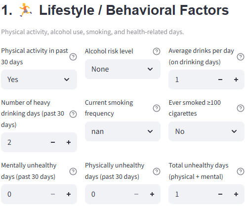
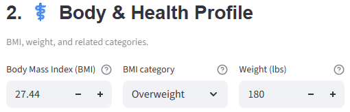
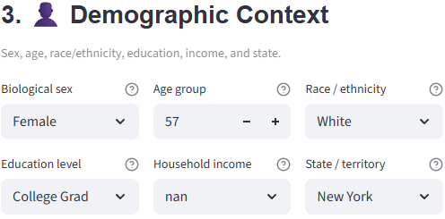
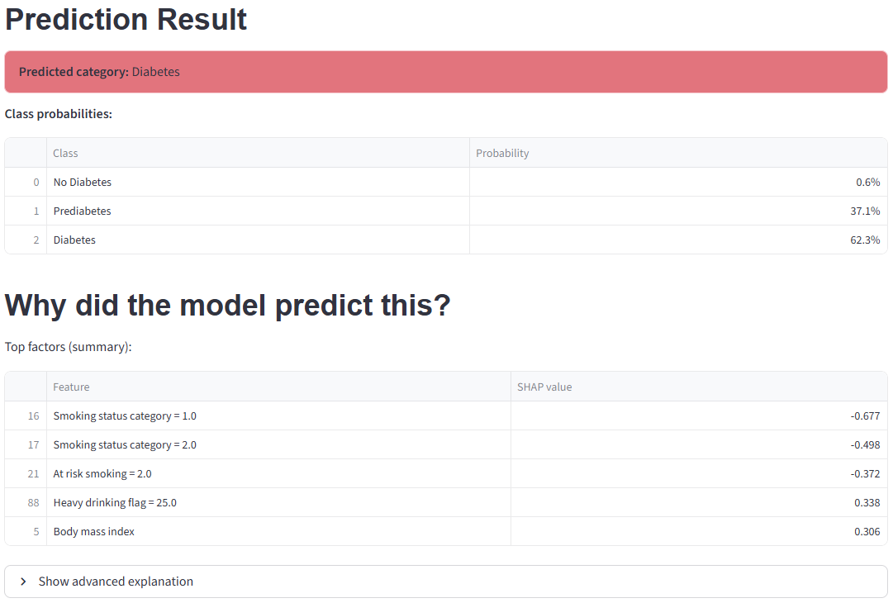
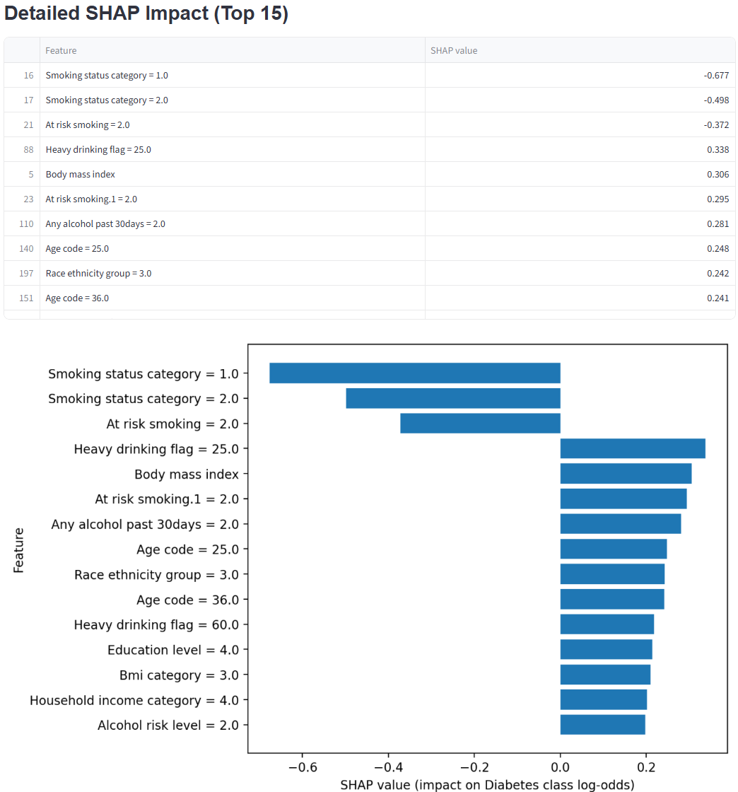

<a id="readme-top"></a>

<div align="center">
    <h1>Behavioral Diabetes Predictor</h1>
    <p> An <b>explainable multiclass</b> Machine Learning application for diabetes risk prediction and quantifiable behavioral contributions. </p>
    </b>

> **Disclaimer:** This application is designed for educational and research purposes only and should not be used for clinical decision-making.
</div>

<br />
<!-- TABLE OF CONTENTS -->
<details>
  <summary>Table of Contents</summary>
  <ol>
    <li>
      <a href="#project-overview">Project Overview</a>
      <ul>
        <li><a href="#built-with">Built With</a></li>
      </ul>
    </li>
    <li><a href="#features">Features</a></li>
    <li><a href="#research-context">Research Context</a></li>
    <li>
        <a href="#getting-started">Getting Started</a>
        <ul>
            <li><a href="#prerequisites">Prerequisites</a></li>
            <li><a href="#1-installation">1. Installation</a></li>
            <li><a href="#2-setting-up-virtual-environment">2. Setting up virtual environment</a></li>
            <li><a href="#3-installing-dependencies">3. Installing dependencies</a></li>
            <li><a href="#4-running-application">4. Running application</a></li>
        </ul>
    </li>
    <li><a href="#authors">Authors</a></li>
    <li><a href="#license">License</a></li>
  </ol>
</details>

## Project Overview

* **Model:**  XGBoost (multi-class)

* **Inputs:**  
    * Behavioral (activity, alcohol, smoking, unhealthy days)  
    * Demographic (sex, age, race, education, income, state)  
    * Anthropometric (BMI, weight)  

* **Target:** 3-class diabetes status 
    * No diabetes
    * Prediabetes
    * Diabetes

* **Training Data:** Composite features engineered from BRFSS 2024 responses

* **Interpretability/Transparency:**  
Uses explainable AI, **SHAP (SHapley Additive exPlanations)** to break down feature contributions to prediction results

### Built With
* [![XGBoost][XGBoost]][XGBoost-url]
* [![SHAP][SHAP]][SHAP-url]
* [![Streamlit][Streamlit]][Streamlit-url]
* [![Python][Python]][Python-url]

<p align="right">(<a href="#readme-top">back to top</a>)</p>

## Features

### Interactive Patient Profiling:
Easy to use, dynamic inputs.  

#### 1. Lifestyle / Behavioral Factors  
---
<p align="center">
  <kbd>
    
  </kbd>
</p>

#### 2. Body & Health Profile  
---
<p align="center">
  <kbd>
    
  </kbd>
</p>

#### 3. Demographic Context  
---
<p align="center">
  <kbd>
    
  </kbd>
</p>

### 4. Real-time prediction  
---
Instant multiclass risk assessment using a pre-trained XGBoost pipeline.

### Explainable AI:

#### 1. Primary SHAP Drivers
---
Reports the top 5 factors responsible for the prediction.  

<p align="center">
  <kbd>
    
  </kbd>
</p>

#### 2. Full SHAP Impact Breakdown  
---
Reports and visualizes the top 15 factors responsible for the prediction.  

<p align="center">
  <kbd>
    
  </kbd>
</p>

### PDF Reports:
Generates a downloadable summary of the patient profile and risk factors.
> See `sample_report.pdf` in assets folder

<p align="right">(<a href="#readme-top">back to top</a>)</p>

## Research Context

**(insert link to journal here)**  

This application is the implementation of a comparative study evaluating the predictive power of **behavioral** vs. **demographic & anthropometric** features.

<p align="right">(<a href="#readme-top">back to top</a>)</p>

## Getting Started

### Prerequisites
* Python 3.9 or newer

### 1. Installation
Clone the repository
```sh
git clone https://github.com/CRodgb/behavioral-diabetes-predictor.git
```
### 2. Setting up virtual environment

1. Create a virtual environment inside of the project folder  
    > Make sure you are in the `behavioral-diabetes-predictor` folder
    ```sh
    python -m venv .venv
    ```

2. Activate your environment  

    For Windows command prompt:  
    ``` sh
    .venv\Scripts\activate.bat
    ```
    For Windows PowerShell:  
    ``` sh
    .venv\Scripts\activate.ps1
    ```
    For macOS and Linux:  
    ``` sh
    source .venv/bin/activate
    ```

### 3. Installing dependencies
> Make sure you see your environment name (.venv) in parentheses before your prompt
```sh
pip install -r requirements.txt
```

### 4. Running application
```sh
streamlit run app/diabetes_predictor.py
```
Or, if that doesn't work:
```sh
python -m streamlit run app/diabetes_predictor.py
```

<p align="right">(<a href="#readme-top">back to top</a>)</p>

## Authors

| Name | Socials |
| :--- | :--- |
| **Sumit Barua** | [![LinkedIn][LinkedIn]](https://www.linkedin.com/in/sumit-barua/) [![GitHub][GitHub]](https://github.com/sum1tbarua) |
| **Sohaib Jabran** | [![LinkedIn][LinkedIn]](https://www.linkedin.com/in/sohaib-jabran/) [![GitHub][GitHub]](https://github.com/sohaibjabran) | |
| **Charles Rodgers** | [![LinkedIn][LinkedIn]](https://www.linkedin.com/in/charlesrodgers01/) [![GitHub][GitHub]](https://github.com/CRodgb) |

<p align="right">(<a href="#readme-top">back to top</a>)</p>

## License
Distributed under the MIT License.  
See `LICENSE` file for more information. 

<p align="right">(<a href="#readme-top">back to top</a>)</p>

<!-- MARKDOWN LINKS & IMAGES -->
[XGBoost]: https://img.shields.io/badge/XGBoost-151D34?style=for-the-badge&logo=xgboost&logoColor=white
[XGBoost-url]: https://xgboost.readthedocs.io/
[SHAP]: https://img.shields.io/badge/SHAP-000000?style=for-the-badge&logo=python&logoColor=white
[SHAP-url]: https://shap.readthedocs.io/
[Streamlit]: https://img.shields.io/badge/Streamlit-FF4B4B?style=for-the-badge&logo=Streamlit&logoColor=white
[Streamlit-url]: https://streamlit.io/
[Python]: https://img.shields.io/badge/Python-3776AB?style=for-the-badge&logo=python&logoColor=white
[Python-url]: https://www.python.org/
[LinkedIn]: https://img.shields.io/badge/LinkedIn-0077B5?style=for-the-badge&logo=linkedin&logoColor=white
[GitHub]: https://img.shields.io/badge/GitHub-100000?style=for-the-badge&logo=github&logoColor=white